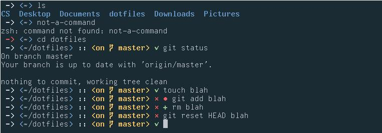

# pointer-zsh-theme

A zsh theme I made because I did not like anyone else's. It is fairly 
minimalistic, with basic git and return status support. No special
fonts/glyphs required (font-awesome etc.).

