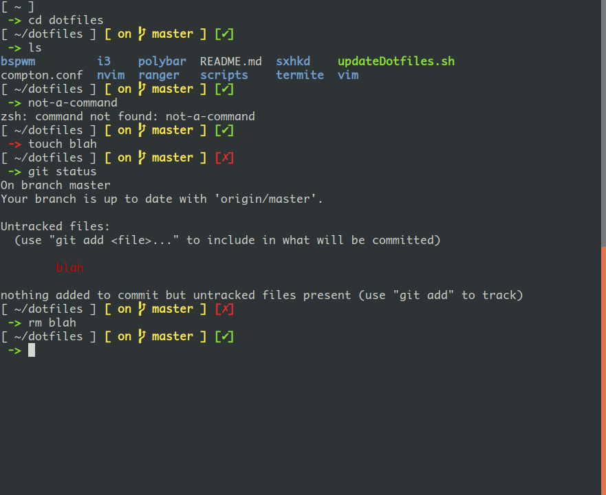

# pointer-zsh-theme

A minimalistic zsh theme I made because I did not like anyone else's. Shows the
present working directory and the return status of the last command (color of the 
->). If you are in a git repository it will show the current branch, and let you 
know if the repository is clean or dirty. I did not include any superfluous junk 
you could easily find elsewhere on your computer (time, date, etc.), so the prompt 
is very quick and responsive.

